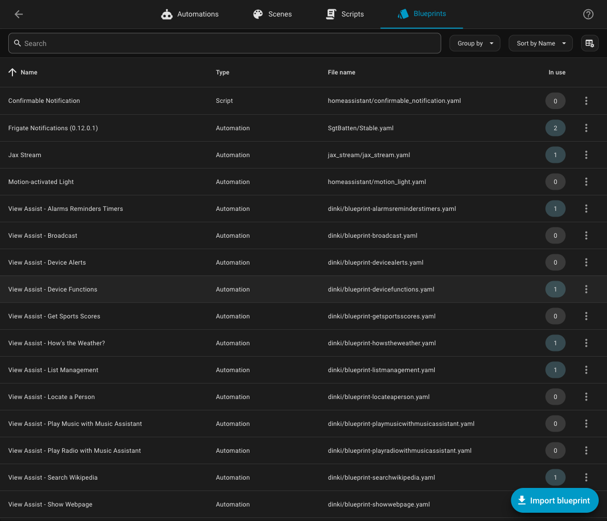
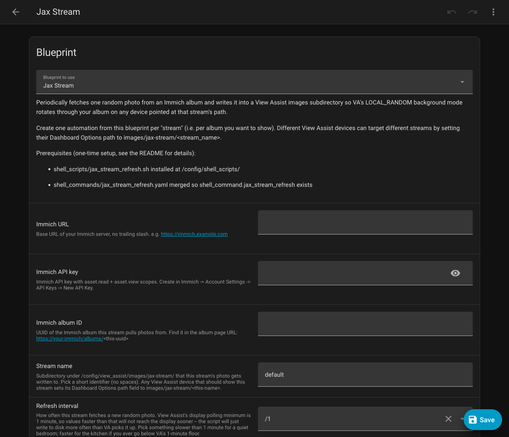
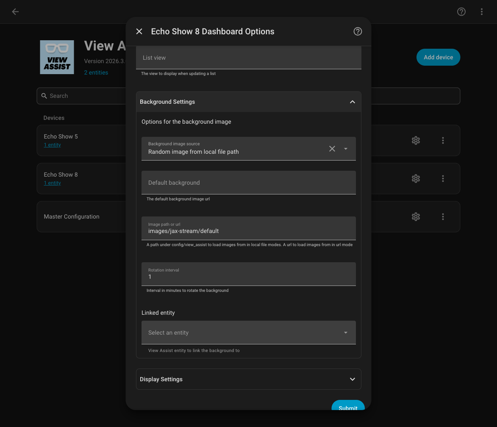
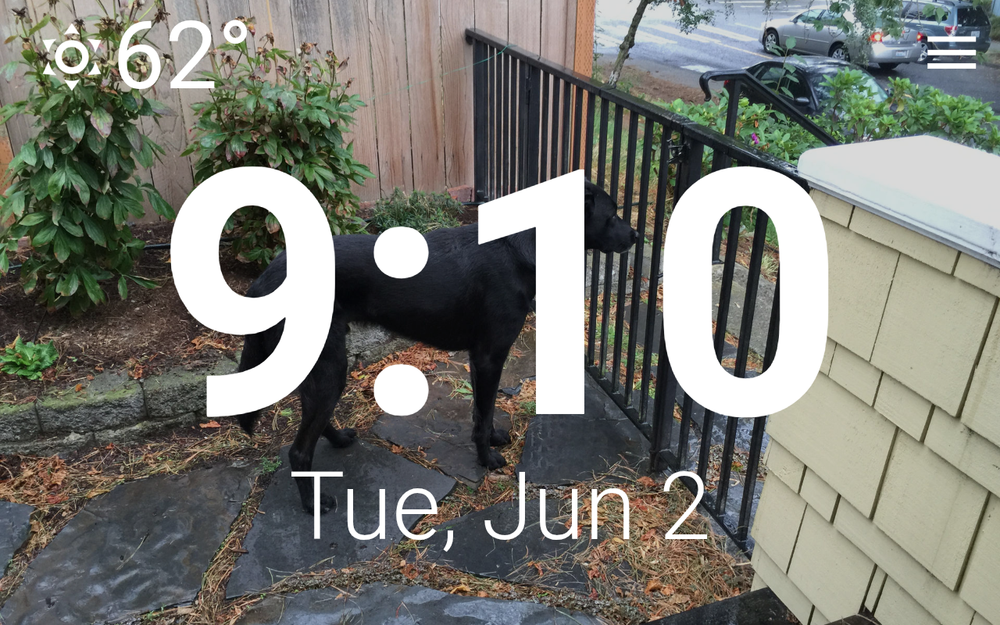

# Jax Stream

*Jax Stream: HA View Assist Immich Slideshow.*

Drop-in slideshow that rotates an Immich album's photos as the background
of [View Assist's](https://github.com/dinki/View-Assist) clock view on
your displays. No HACS dependencies. Supports multiple independent
streams so different displays can show different albums.

## Dedication

In my old setup, one of the things I loved seeing was the goofy mug of
my incredible dog Jackson ("Jax" for short) as I walked by one of my
Echo Shows. When switching over to View Assist, I wanted that sweet
reminder of my gentle giant -- so this is dedicated as a loving
memory for him.


## Why this exists

A few Immich+HA slideshow options already exist; none of them fit a
View Assist install without compromises:

| Project | Gap that left a hole |
|---|---|
| [damongolding/immich-kiosk](https://github.com/damongolding/immich-kiosk) | Works well, but requires running a separate Docker container next to Immich and HA. Adds an extra service to manage, monitor, and update |
| [mulder82/immich-slideshow](https://github.com/mulder82/immich-slideshow) (HACS) | Active and maintained, but POSTs `/api/search/random` with no `albumIds` filter -- you get a random asset from the whole library, not from one album. No per-device targeting |
| [outadoc/immich-home-assistant](https://github.com/outadoc/immich-home-assistant) (HACS) | Has album filtering, but unmaintained for 2+ years, 5-minute interval hardcoded, broken on HA 2025.6+ |

This distro is the "no extra container, no broken HACS dep" middle
ground: pure HA core + View Assist, per-album streams, multi-device
per-stream targeting. The trade-off is that it's a handful of small
config files instead of a single integration -- but those files are
unsurprising HA primitives (a `shell_command` and a blueprint
automation) rather than a dependency you have to track.

## What you get

- Rotating photo background on each VA device's clock view, default
  1-minute interval (configurable per stream; VA's polling minimum
  is 1 minute, so anything faster won't reach the display sooner)
- Modified VA clock view: time + weather positioned bottom-left over the
  photo, 70% text opacity (no dark overlay needed), blurred-fill behind
  a `contain`-letterboxed photo (so portrait shots don't get black bars)
- Responsive sizing: works on 960x480 (e.g. Echo Show 5) and 1280x800
  (e.g. Echo Show 8) without tweaks
- Per-device stream targeting (e.g. landscapes in the living room,
  family photos in the kitchen, kids' artwork at the office)

## Prerequisites

- Home Assistant with the View Assist integration installed and at least
  one device set up
- An Immich server reachable from your HA host, with at least one album
- An Immich API key with `asset.read` and `asset.view` scopes
  (Account Settings -> API Keys -> New API Key). If you plan to enable
  swipe, also add `albumAsset.delete` so swipe-left can remove photos
  from the album
- Shell or file access to your `/config/` directory
- Both `python3` and `curl` available in HA's environment -- `curl` does
  the HTTP requests (POST search/random, GET thumbnail bytes), `python3`
  parses the one-line JSON response to pull the asset id out (avoiding a
  `jq` dependency). HA OS and HA Container both include both; HA Core
  inherits from the host

## Immich over HTTP or HTTPS (incl. self-signed certs)

The **Immich URL** you enter in the blueprint can use either scheme:

- **`http://...`** works with no changes -- e.g. `http://10.0.0.5:2283`
  or `http://immich.local:2283`. `curl` does plain HTTP; nothing to edit.
- **`https://...` with a publicly-trusted (or already-installed CA)
  cert** also works as-is.
- **`https://...` with a self-signed / private-CA cert** fails by
  default: `curl` aborts with a certificate-verification error, `set -e`
  stops the script, and the photo never updates. Two ways to fix it:

  1. **Tick "Allow insecure HTTPS" in the blueprint (quick, less secure).**
     The blueprint has an `allow_insecure` checkbox (default off). When on,
     the scripts add `-k` (`--insecure`) to **every** `curl` -- search,
     thumbnail calls -- so a self-signed setup works with no
     script edit. This turns off TLS cert checking entirely: fine on a
     trusted LAN, not for traffic crossing untrusted networks. Leave it off
     for `http://`, publicly-trusted `https://`, or an installed CA.
  2. **Point `curl` at your CA cert (more secure, manual).** Keeps
     verification on. Put the CA / self-signed cert where HA can read it
     (e.g. `/config/immich-ca.crt`) and insert it into the `CURL_OPTS`
     array near the top of each script:

     ```bash
     CURL_OPTS=(-fsS --cacert /config/immich-ca.crt)
     ```

  (Most lab setups just point the blueprint at the plain-`http://` Immich
  address on the LAN and skip all of this.)

## Files in this distro

| File | What it does | Required? |
|---|---|---|
| [`shell_scripts/jax_stream_refresh.sh`](shell_scripts/jax_stream_refresh.sh) | Fetches a random photo from Immich, applies the photo selector and landscape filter, writes `random.jpg` and sidecars | Required |
| [`blueprints/automation/jax_stream.yaml`](blueprints/automation/jax_stream.yaml) | Automation blueprint -- import once, create one automation per stream | Required |
| [`view_assist/views/clock/clock.yaml`](view_assist/views/clock/clock.yaml) | Modified VA clock view: responsive fonts, 70% text opacity, blurred-fill letterbox | Optional |
| [`shell_scripts/jax_stream_swipe.sh`](shell_scripts/jax_stream_swipe.sh) | Swipe handler: right swipe advances; left swipe removes the photo from the Immich album then advances | Swipe only |
| [`www/jax_stream_swipe.js`](www/jax_stream_swipe.js) | Browser module that detects a horizontal swipe on the clock view and calls `shell_command.jax_stream_swipe`. No HACS dependency | Swipe only |
| [`shell_commands/jax_stream_refresh.yaml`](shell_commands/jax_stream_refresh.yaml) | Drop-in for split `shell_commands/` setups -- contents are what you paste in step 2 for a standard install | Advanced only |
| [`shell_commands/jax_stream_swipe.yaml`](shell_commands/jax_stream_swipe.yaml) | Drop-in for split `shell_commands/` setups -- contents are what you paste in step 2 for a standard install | Advanced only |

## Install

> **Using a split `shell_commands/` dir or `packages/`?** See
> [Advanced config layouts](#advanced-config-layouts) for drop-in instructions
> before starting.

### 1. Copy the files into your HA config

Place each file at the matching path under your `/config/`:

```
/config/shell_scripts/jax_stream_refresh.sh
/config/blueprints/automation/jax_stream/jax_stream.yaml
/config/view_assist/views/clock/clock.yaml   (OPTIONAL -- cosmetic only; back up the original first)
```

(The `jax_stream/` subdir under `blueprints/automation/` is a
namespacing convention; HA expects blueprints to live in author/name
subdirectories.)

**The clock view swap is optional.** The slideshow rotates on View
Assist's *stock* clock view too -- the stock `clock.yaml` already reads
VA's `background` attribute, so the photo shows through with no file
swap. Only copy `view_assist/views/clock/clock.yaml` if you want the
distro's cosmetic tweaks; see [About the modified `clock.yaml`](#about-the-modified-clockyaml).

### 2. Wire up `shell_command`

> **Using a split `shell_commands/` dir or `packages/`?** See
> [Advanced config layouts](#advanced-config-layouts).

Open `/config/configuration.yaml` and add (or merge into an existing
`shell_command:` block):

```yaml
shell_command:
  jax_stream_refresh: >-
    bash /config/shell_scripts/jax_stream_refresh.sh
    "{{ immich_host }}" "{{ immich_api_key }}" "{{ album_id }}" "{{ stream_name }}"
    "{{ landscape_only }}" "{{ allow_insecure }}"
```

If you plan to use swipe gestures, add the second entry too:

```yaml
shell_command:
  jax_stream_refresh: >-
    bash /config/shell_scripts/jax_stream_refresh.sh
    "{{ immich_host }}" "{{ immich_api_key }}" "{{ album_id }}" "{{ stream_name }}"
    "{{ landscape_only }}" "{{ allow_insecure }}"
  jax_stream_swipe: >-
    bash /config/shell_scripts/jax_stream_swipe.sh "{{ stream }}" "{{ direction }}"
```

### 3. Create one automation per stream from the blueprint

Each "stream" is one Immich album feeding one (or more) View Assist
devices' background. The blueprint shipped in this distro creates
one automation per stream.

In HA: Settings -> Automations & Scenes -> Blueprints. The "Jax Stream"
row appears in the list:



Click the "Jax Stream" row (or its overflow menu -> **Create automation**)
to open the instance form, then fill in:

- **Immich URL**: e.g. `https://immich.example.com` (no trailing slash)
- **Immich API key**: a key with `asset.read` + `asset.view` scopes
- **Immich album ID**: UUID from your Immich album page URL
- **Stream name**: short identifier, no spaces (e.g. `family`,
  `landscapes`). This becomes the subdirectory under
  `/config/view_assist/images/jax-stream/` and the value you
  type into each device's VA Dashboard Options path field
- **Refresh interval**: `Every minute` is the default; pick slower
  if you want photos to linger



Click **Save**. HA then prompts with a **Rename** dialog (the name
defaults to "Jax Stream") -- accept it, or give each stream a distinct
name (e.g. "Jax Stream: family") so multiple streams are easy to tell
apart. Confirm to finish creating the automation. Repeat for each
additional stream/album.

You can verify it ticked by checking that the file
`/config/view_assist/images/jax-stream/<stream_name>/random.jpg`
appears within a minute and its timestamp updates on the chosen interval.

### 4. Restart Home Assistant

`shell_command` changes are picked up only on a full HA restart --
there is no reload service for it. Restart from Settings -> System ->
Restart, or via Developer Tools.

After the restart, automations created from the blueprint are already
active. If you later change the blueprint file itself, reload automations
(Developer Tools -> YAML -> Automations) without a full restart.

### 5. Configure View Assist on each device

For every VA device you want on a stream:

Settings -> Devices & Services -> View Assist -> *your device* -> Configure
-> Dashboard Options -> Background Settings:

- **Background image source**: `Random image from local file path`
- **Path field**: `images/jax-stream/<stream_name>` (e.g.
  `images/jax-stream/default`). No leading slash, no `www/`,
  no `/config/` prefix -- VA prepends `/config/view_assist/` itself.
- **Default background**: leave empty
- **Rotation interval**: `1` (minute -- VA's minimum)



Submit. Within a minute, the device's clock view should swap to a
photo from your album, and rotate every minute thereafter:



## Multi-stream

To add a second stream (e.g. a different album for a different device):

1. Repeat install step 3: create another automation from the same
   blueprint, with a different `album_id` and a different `stream_name`
2. Point the target device's VA Dashboard Options path field at
   `images/jax-stream/<new_stream_name>`

You can vary the refresh interval per stream too -- pick slower for
a quiet bedroom, faster for the kitchen.

## Blueprint inputs

Each automation created from the blueprint is one stream. The instance form
asks for:

| Input | What it does |
|---|---|
| **Immich URL** | Base URL, no trailing slash (a stray one is tolerated) |
| **Immich API key** | `asset.read` + `asset.view` |
| **Immich album ID** | UUID from the album page URL |
| **Stream name** | Subdir under `images/jax-stream/`; also the VA path value |
| **Refresh interval** | How often to fetch a new photo |
| **Landscape only** | Keep only landscape photos (over-fetch + filter) |
| **Enable swipe** | Turn on swipe gestures (requires swipe file install; adds `albumAsset.delete` scope requirement for swipe-left) |
| **Allow insecure HTTPS** | Add `curl -k` for self-signed certs (default off) |

## Swipe

Swipe **right** to advance to the next photo. Swipe **left** to remove the
current photo from the Immich album and advance (useful for curation: it
calls Immich's `DELETE /api/albums/{id}/assets` endpoint, which removes the
photo from the album without deleting the underlying asset from your library).

The swipe module fires only when a Jax Stream photo is on screen, so it does
not interfere with View Assist's tap-to-navigate on other views.

### Enabling swipe (one-time setup)

1. **Install the swipe files** (in addition to the basic ones):
   ```
   /config/shell_scripts/jax_stream_swipe.sh
   /config/www/jax_stream_swipe.js
   ```
   Then add the swipe entry to your `shell_command:` block in `configuration.yaml`
   (see [step 2](#2-wire-up-shell_command) above for the YAML to paste).

2. **Register the browser module.** Add to `configuration.yaml`:

   ```yaml
   frontend:
     extra_module_url:
       - /local/jax_stream_swipe.js?v=1
   ```

   (`/config/www/` is served at `/local/`.) If you already have a `frontend:`
   block, append the entry to the existing `extra_module_url` list rather than
   adding a second `frontend:` key. For `packages/` layouts, see
   [Advanced config layouts](#advanced-config-layouts).

   `extra_module_url` is read at startup, so **restart HA**, then reload the
   device's WebView once. When you later update `jax_stream_swipe.js`, bump
   the integer (`?v=2`, `?v=3`, ...) and restart, or the browser keeps the
   cached copy.
3. **Enable swipe in the blueprint.** Open the automation created from the
   Jax Stream blueprint, find the **Enable swipe** toggle, and turn it on.
   If you want swipe-left to remove photos from the album, make sure your
   Immich API key has the `albumAsset.delete` scope before saving.

## About the modified `clock.yaml`

The bundled `view_assist/views/clock/clock.yaml` is based on VA's
upstream `clockalt.yaml`, with three changes:

- **Responsive font sizes** using `vh` / `vw` units (`30vh` time,
  `8vh` weather text, `10vw` weather icon) instead of the upstream's
  fixed `%` sizes that overflow smaller screens
- **70% text opacity** via `color: rgba(255, 255, 255, 0.7)` plus
  retained `text-shadow` / `drop-shadow` for legibility -- the photo
  shows through without needing a dark overlay layer
- **Blurred-fill background** via `extra_styles` injecting
  `ha-card::before` (blurred cover) and `ha-card::after`
  (sharp contain). The whole photo is visible, and the letterbox
  bars (for portrait photos on a landscape display) are filled with
  a blurred version of the same image

**Caveat**: if you later call `view_assist.load_asset` for `clock`
with `download_from_repo: true`, VA will overwrite this file with the
upstream pristine version. To restore the modified version, just
copy `view_assist/views/clock/clock.yaml` from this distro folder
back into place and call `view_assist.load_asset` with
`download_from_repo: false` to reinstall.

After replacing `clock.yaml`, reload the view so VA's Lovelace
storage picks it up:

```
service: view_assist.load_asset
data:
  asset_class: views
  name: clock
  download_from_repo: false
```

Then navigate any device off the clock view and back (or wait for
the auto-revert timeout) so the WebView refetches.

## Advanced config layouts

If you use a split `shell_commands/` directory or a `packages/` setup, the
files in this distro slot straight in without any `configuration.yaml` edit.

**Split `shell_commands/` directory**

If `configuration.yaml` already has:

```yaml
shell_command: !include_dir_merge_named shell_commands
```

place the `.yaml` files from `shell_commands/` into `/config/shell_commands/`
and they are picked up automatically on next restart. No `configuration.yaml`
edit needed.

> **Note:** every file in that directory must contain bare key-value pairs at
> the top level -- no `shell_command:` wrapper. A wrapped file silently kills
> the entire `shell_command` integration (all commands vanish with no obvious
> error).

**`packages/` directory**

Create `/config/packages/jax_stream.yaml` (any filename works) and put the
`shell_command:` block from install step 2 inside it. If `configuration.yaml`
does not already load the packages directory, add:

```yaml
homeassistant:
  packages: !include_dir_named packages
```

For the swipe `frontend:` entry, put it in the same package file:

```yaml
frontend:
  extra_module_url:
    - /local/jax_stream_swipe.js?v=1
```

## Troubleshooting

- **Automation fires but file doesn't appear/update**: check HA logs
  for the `shell_command`'s stderr. Most common: typo in the
  `immich_host` or `immich_api_key` value you entered in the blueprint
  form; Immich unreachable from the HA host (try `curl` from inside
  the HA container); `album_id` doesn't match a real album; or an
  `https://` Immich with a self-signed cert that `curl` won't trust
  (see [Immich over HTTP or HTTPS](#immich-over-http-or-https-incl-self-signed-certs)).
  `set -e` in the shell_command means the first failing `curl` aborts
  the rest, so the file just won't update.
- **File updates but display doesn't change**: VA might be in
  `DEFAULT_BACKGROUND` mode (cache-buster frozen). Confirm Dashboard
  Options shows `Random image from local file path`.
- **Background goes black / broken image**: the path field is usually
  wrong. It should be `images/jax-stream/<stream>`, never
  `/config/view_assist/...` or `www/...` -- VA prepends
  `/config/view_assist/` itself.
- **All devices show the same photo / wrong album**: each device's
  Dashboard Options path field needs to point at that device's stream.
- **`shell_command` entities missing after restart**: if all
  `shell_command.*` services vanish, check the HA system log for
  `Invalid config for 'shell_command'`. A YAML file in `shell_commands/`
  with a `shell_command:` wrapper at the top (instead of bare key-value
  pairs) silently kills the entire integration. Remove the wrapper and restart.

## Required Immich API key scopes

Verified against `server/src/enum.ts` and the asset-media/search
controllers on the Immich `main` branch:

| Endpoint | Scope | When |
|---|---|---|
| `POST /api/search/random` | `asset.read` | always |
| `GET /api/assets/{id}/thumbnail?size=preview` | `asset.view` | always |
| `DELETE /api/albums/{id}/assets` | `albumAsset.delete` | swipe-left only |

Basic slideshow: **`asset.read` + `asset.view`**. Add
**`albumAsset.delete`** if you enable swipe so swipe-left can remove photos
from the album. `asset.download` is not needed -- thumbnail/preview is what
we use, and it's also what most WebViews can render (the `/original` endpoint
returns the raw file, which for HEIC iPhone photos most WebViews cannot
display).

## File map

| File | Where it goes |
|---|---|
| `shell_scripts/jax_stream_refresh.sh` | `/config/shell_scripts/jax_stream_refresh.sh` |
| `shell_commands/jax_stream_refresh.yaml` | merged into `shell_command:` (via split-config include, or pasted into `configuration.yaml`) |
| `blueprints/automation/jax_stream.yaml` | `/config/blueprints/automation/jax_stream/jax_stream.yaml` (note the namespacing subdir) |
| `view_assist/views/clock/clock.yaml` | `/config/view_assist/views/clock/clock.yaml` (replaces VA's default; back up first) |
| `shell_scripts/jax_stream_swipe.sh` | `/config/shell_scripts/jax_stream_swipe.sh` (swipe only) |
| `shell_commands/jax_stream_swipe.yaml` | merged into `shell_command:` like the refresh one (swipe only) |
| `www/jax_stream_swipe.js` | `/config/www/jax_stream_swipe.js`, served at `/local/jax_stream_swipe.js`; register via `frontend.extra_module_url` (swipe only) |

## Attribution

Built for and on top of [View Assist](https://github.com/dinki/View-Assist)
by @dinki et al. The bundled `clock.yaml` is a modified version of the
upstream `clockalt.yaml`.
